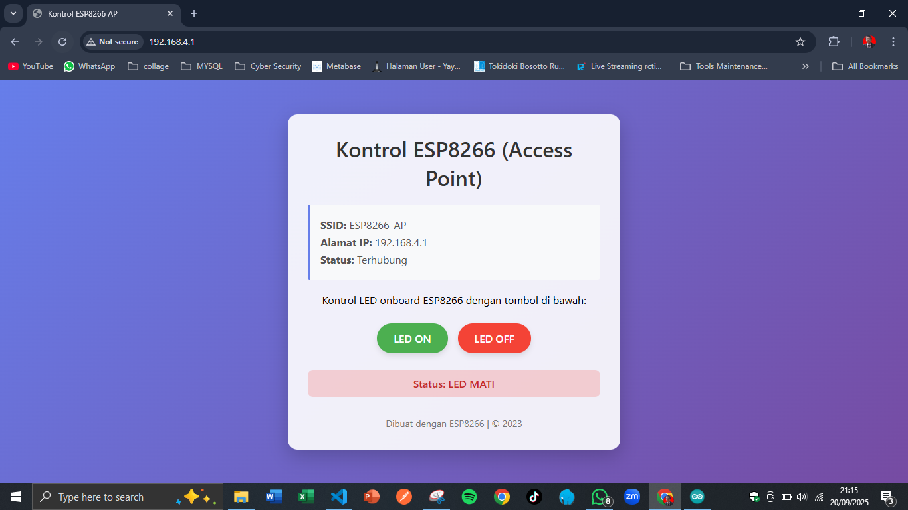
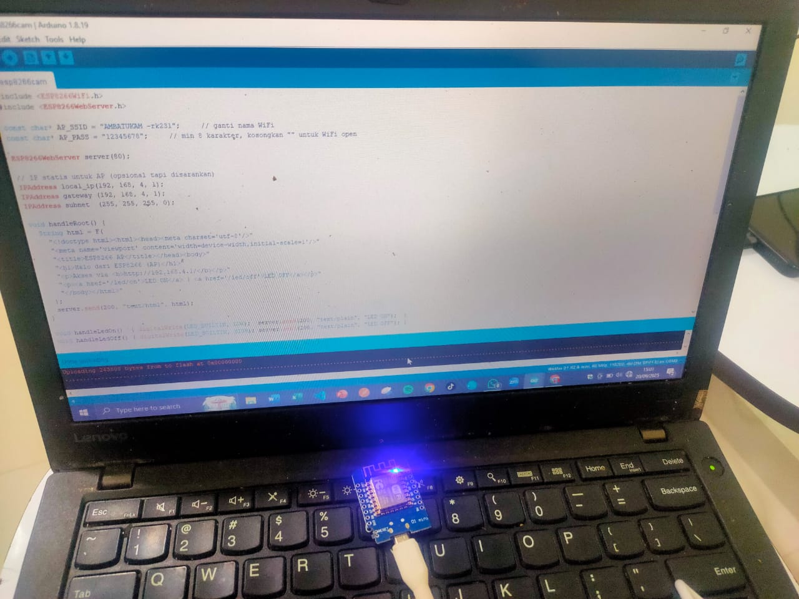

# ESP8266 Access Point Web Server - Screenshots

Berikut adalah tampilan antarmuka web dari proyek ESP8266 Access Point:

## 📱 Tampilan Antarmuka Web

*Antarmuka web responsif untuk mengontrol LED onboard ESP8266*

## 📋 Informasi Proyek

Antarmuka web yang dihasilkan memiliki fitur-fitur berikut:

- **Desain modern** dengan gradient background
- **Tombol responsif** untuk mengontrol LED (ON/OFF)
- **Display status** LED yang berubah sesuai keadaan
- **Informasi koneksi** (SSID dan IP address)
- **Tampilan mobile-friendly** yang responsif

## 🎨 Skema Warna

Antarmuka menggunakan skema warna yang menarik:
- Background: Gradient biru-ungu (`#667eea` ke `#764ba2`)
- Tombol ON: Hijau (`#4CAF50`)
- Tombol OFF: Merah (`#f44336`)
- Status ON: Hijau transparan
- Status OFF: Merah transparan

## 📟 Serial Output

Pada Serial Monitor, Anda akan melihat informasi seperti:
- Status inisialisasi AP
- Alamat IP server (biasanya 192.168.4.1)
- Status web server
- Log aktivitas koneksi client

## 🔄 Cara Kerja

1. ESP8266 membuat access point dengan SSID yang ditentukan
2. Client terhubung ke jaringan ESP8266_AP
3. Browser mengakses alamat IP 192.168.4.1
4. Antarmuka web ditampilkan dengan kontrol LED
5. Tombol mengirim request ke endpoint `/led/on` atau `/led/off`
6. Status LED diperbarui secara real-time tanpa reload halaman

Untuk screenshot aktual, silakan jalankan kode pada ESP8266 Anda dan akses antarmuka web melalui browser di perangkat yang terhubung ke jaringan ESP8266_AP.